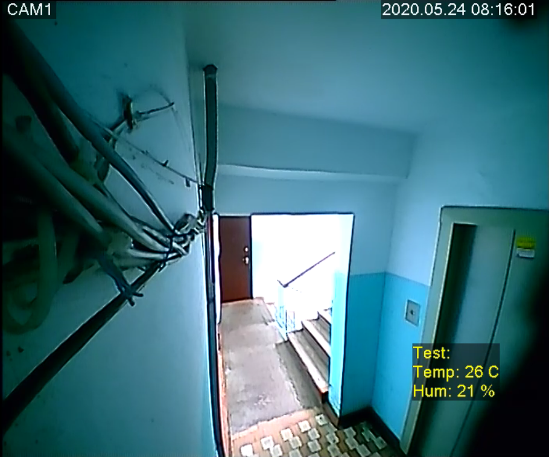

# python-dvr
Python library for configuring a wide range of IP cameras which use the NETsurveillance ActiveX plugin
XMeye SDK

## DeviceManager.py
DeviceManager.py is standalone tkinter and console interface program souch as original DeviceManager.exe
it possible work on both systems - if no TK - it starts with console interface

## DVR-IP, NetSurveillance  or "Sofia" Protocol
The NETSurveillance ActiveX plugin uses a TCP based protocol refered to simply as the "Digital Video Recorder Interface Protocol" by the "Hangzhou male Mai Information Co".

There is very little software support or documentation other than through tools provided by the manufacturers these cameras, which leaves many configuration options inaccessible.

*Command and response codes can be found here:*

https://gist.github.com/ekwoodrich/a6d7b8db8f82adf107c3c366e61fd36f

## Basic usage

```python
from dvrip import DVRIPCam
from time import sleep

host_ip = '192.168.0.100'

cam = DVRIPCam(host_ip, "admin", "")
if cam.login():
	print("Success! Connected to " + host_ip)
else:
	print("Failure. Could not connect.")

time = cam.get_time()
print("Camera time:", time)

# Reboot test
cam.reboot()
sleep(60) # wait while camera starts

# Login again
cam.login()
# Sync camera time with PC time
cam.set_time()
cam.close()
```
## OSD special text displaying
```python
info = cam.get_info("fVideo.OSDInfo")
info["OSDInfo"][0]["Info"] = ["Test:","Temp: 26 C","Hum: 21 %"] #3 lines text
info["OSDInfo"][0]["OSDInfoWidget"]["EncodeBlend"] = True
info["OSDInfo"][0]["OSDInfoWidget"]["PreviewBlend"] = True
info["OSDInfo"][0]["OSDInfoWidget"]["BackColor"]= '0x80000000'
info["OSDInfo"][0]["OSDInfoWidget"]["FrontColor"]= '0xF0FFFF00'
info["OSDInfo"][0]["OSDInfoWidget"]["RelativePos"] = [6144,6144,8192,8192] #OSD block position
cam.set_info("fVideo.OSDInfo", info)
```


## Camera modes/settings

```python
params = cam.get_info("Camera")
# Returns data like this:
# {'ClearFog': [{'enable': 0, 'level': 50}], 'DistortionCorrect': {'Lenstype': 0, 'Version': 0},
# 'FishLensParam': [{'CenterOffsetX': 300, 'CenterOffsetY': 300, 'ImageHeight': 720,
# 'ImageWidth': 1280, 'LensType': 0, 'PCMac': '000000000000', 'Radius': 300, 'Version': 1,
# 'ViewAngle': 0, 'ViewMode': 0, 'Zoom': 100}], 'FishViCut': [{'ImgHeight': 0, 'ImgWidth': 0,
# 'Xoffset': 0, 'Yoffset': 0}], 'Param': [{'AeSensitivity': 5, 'ApertureMode': '0x00000000',
# 'BLCMode': '0x00000000', 'DayNightColor': '0x00000000', 'Day_nfLevel': 3, 'DncThr': 30,
# 'ElecLevel': 50, 'EsShutter': '0x00000002', 'ExposureParam': {'LeastTime': '0x00000100',
# 'Level': 0, 'MostTime': '0x00010000'}, 'GainParam': {'AutoGain': 1, 'Gain': 50},
# 'IRCUTMode': 0, 'IrcutSwap': 0, 'Night_nfLevel': 3, 'PictureFlip': '0x00000000',
# 'PictureMirror': '0x00000000', 'RejectFlicker': '0x00000000', 'WhiteBalance': '0x00000000'}],
# 'ParamEx': [{'AutomaticAdjustment': 3, 'BroadTrends': {'AutoGain': 0, 'Gain': 50},
# 'CorridorMode': 0, 'ExposureTime': '0x100', 'LightRestrainLevel': 16, 'LowLuxMode': 0,
# 'PreventOverExpo': 0, 'SoftPhotosensitivecontrol': 0, 'Style': 'type1'}], 'WhiteLight':
# {'MoveTrigLight': {'Duration': 60, 'Level': 3}, 'WorkMode': 'Auto', 'WorkPeriod':
# {'EHour': 6, 'EMinute': 0, 'Enable': 1, 'SHour': 18, 'SMinute': 0}}}

# Get current encoding settings
enc_info = cam.get_info("Simplify.Encode")
# Returns data like this:
# [{'ExtraFormat': {'AudioEnable': False, 'Video': {'BitRate': 552, 'BitRateControl': 'VBR',
# 'Compression': 'H.265', 'FPS': 20, 'GOP': 2, 'Quality': 3, 'Resolution': 'D1'},
# 'VideoEnable': True}, 'MainFormat': {'AudioEnable': False, 'Video': {'BitRate': 2662,
# 'BitRateControl': 'VBR', 'Compression': 'H.265', 'FPS': 25, 'GOP': 2, 'Quality': 4,
# 'Resolution': '1080P'}, 'VideoEnable': True}}]

# Change bitrate
NewBitrate = 7000
enc_info[0]['MainFormat']['Video']['BitRate'] = NewBitrate
cam.set_info("Simplify.Encode", enc_info)

# Get videochannel color parameters
colors = cam.get_info("AVEnc.VideoColor.[0]")
# Returns data like this:
# [{'Enable': True, 'TimeSection': '0 00:00:00-24:00:00', 'VideoColorParam': {'Acutance': 3848,
# 'Brightness': 50, 'Contrast': 50, 'Gain': 0, 'Hue': 50, 'Saturation': 50, 'Whitebalance': 128}},
# {'Enable': False, 'TimeSection': '0 00:00:00-24:00:00', 'VideoColorParam': {'Acutance': 3848,
# 'Brightness': 50, 'Contrast': 50, 'Gain': 0, 'Hue': 50, 'Saturation': 50, 'Whitebalance': 128}}]

# Change picture title
cam.channel_title(["Backyard"])

# Change IR Cut
cam.set_info("Camera.Param.[0]", { "IrcutSwap" : 0 })
```


## Upgrade camera firmware

```python
# Optional: get information about upgrade parameters
print(cam.get_upgrade_info())

# Do upgrade
cam.upgrade("General_HZXM_IPC_HI3516CV300_50H20L_AE_S38_V4.03.R12.Nat.OnvifS.HIK.20181126_ALL.bin")
```

## Acknowledgements

*Telnet access creds from gabonator*

https://gist.github.com/gabonator/74cdd6ab4f733ff047356198c781f27d
